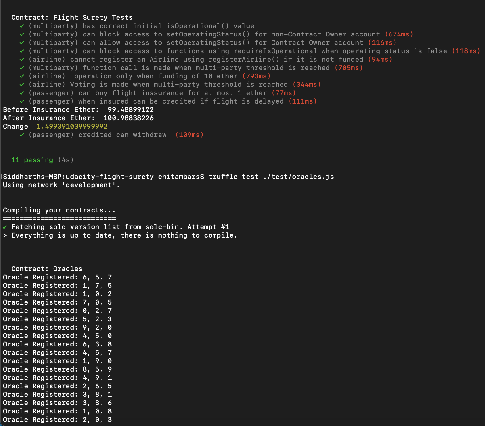
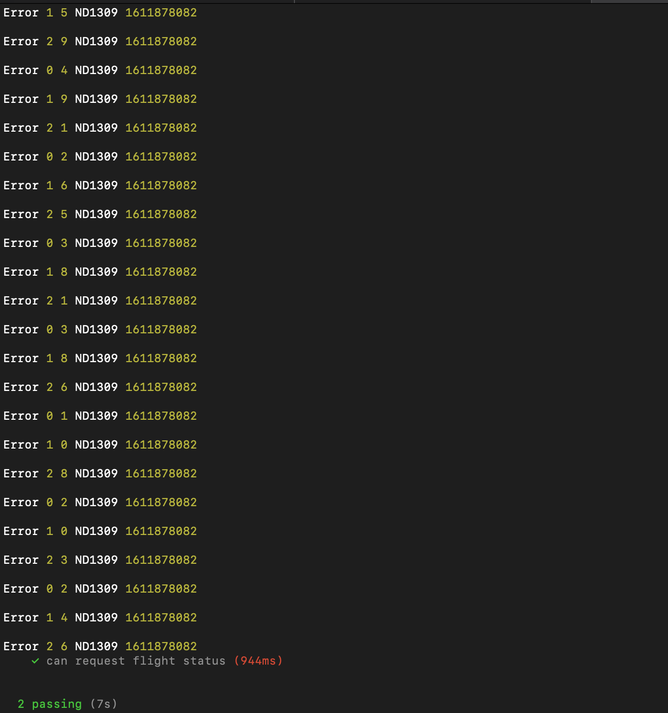
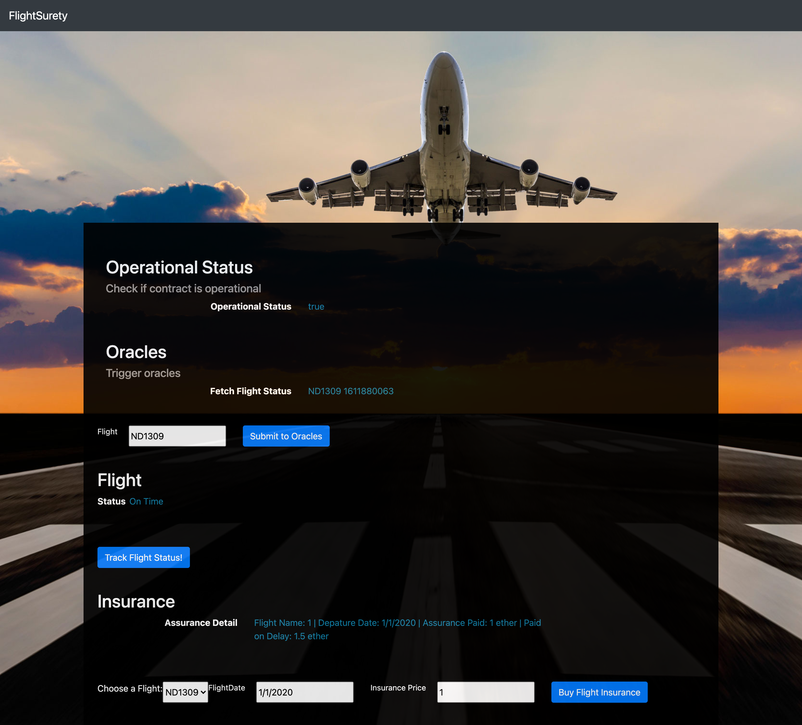

# FlightSurety

FlightSurety is a sample application project for Udacity's Blockchain course.

## Configuration

Truffle v5.1.60 (core: 5.1.60)

Node v14.15.1

## Requirements

Separation of Concerns

1. Flight surety Data contract for data persistence.
2. Flight surety App contract for app logic & oracle.
3. DAPP client for triggering contract call.s
4. Server app for simulating oracles.

Airlines

1. Register first airline when contract is deployed.
2. Only existing airline may register a new airline until there are atleast 4 airlines registered.
3. Registration of 5th & subsequent airlines registered.
4. Airlines can be registered, but does  not participate in contract until it submits funding of 10 ether.

Passengers

1. Passengers may put upto 1 ether for purchasing flight insurance.
2. Flight numbers & timestampsare fixed for the purposes of the project & can be defined in the DApp client.
3. If the flight is delayed dye to airline fault, passenger receives credit of 1.5X of the amount they paid.

Oracles

1. Oracles are implemented as a server app.
2. Upon startup , 20+ oracles are registered and their assigned indexes are persisted in memory.
3. Client DApp is used to trigger request to update flight status generating Oracle Request event that is captured by server.
4. Server will loop thru registered oracles,identify those oracles for which the request applies, & respond by calling into app logic contract with app status code.

General

1. Contracts must have operational status control.
2. Functions must fail fast - use require() at start.
3. Scaffolding code is provided.

## Install

This repository contains Smart Contract code in Solidity (using Truffle), tests (also using Truffle), dApp scaffolding (using HTML, CSS and JS) and server app scaffolding.

To install, download or clone the repo, then:

`npm install`
`truffle compile`

## Tests

## GUI Flow

## Develop Client

To run truffle tests:

`truffle test ./test/flightSurety.js`
`truffle test ./test/oracles.js`

To use the dapp:

`truffle migrate`
`npm run dapp`

To view dapp:

`http://localhost:8000`

## Develop Server

`npm run server`
`truffle test ./test/oracles.js`

## Deploy

To build dapp for prod:
`npm run dapp:prod`

Deploy the contents of the ./dapp folder

## Resources

* [How does Ethereum work anyway?](https://medium.com/@preethikasireddy/how-does-ethereum-work-anyway-22d1df506369)
* [BIP39 Mnemonic Generator](https://iancoleman.io/bip39/)
* [Truffle Framework](http://truffleframework.com/)
* [Ganache Local Blockchain](http://truffleframework.com/ganache/)
* [Remix Solidity IDE](https://remix.ethereum.org/)
* [Solidity Language Reference](http://solidity.readthedocs.io/en/v0.4.24/)
* [Ethereum Blockchain Explorer](https://etherscan.io/)
* [Web3Js Reference](https://github.com/ethereum/wiki/wiki/JavaScript-API)